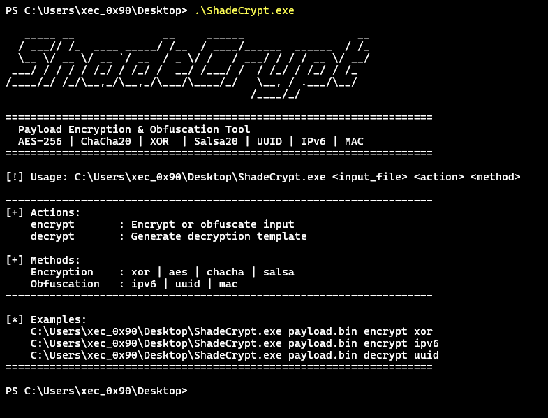
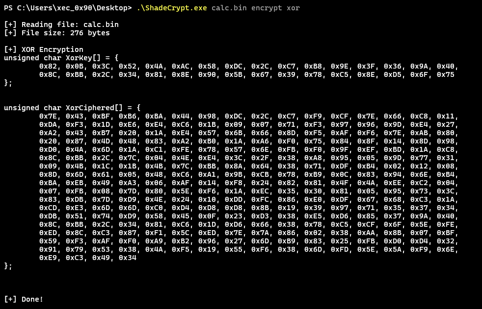
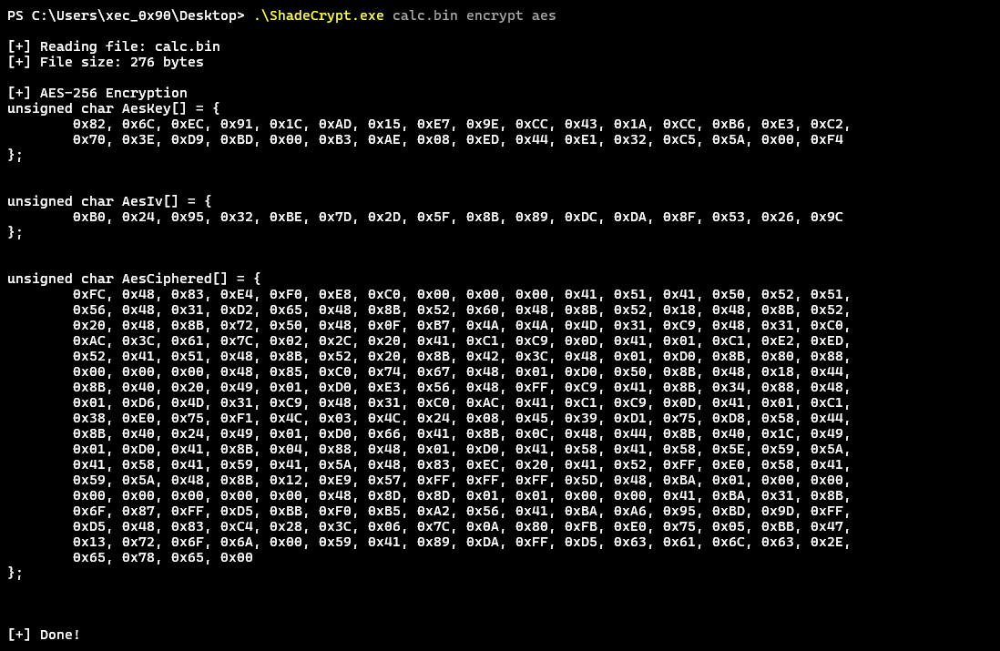
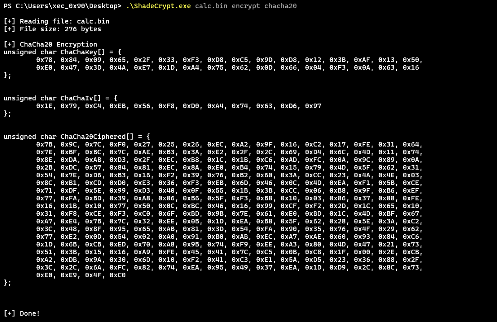
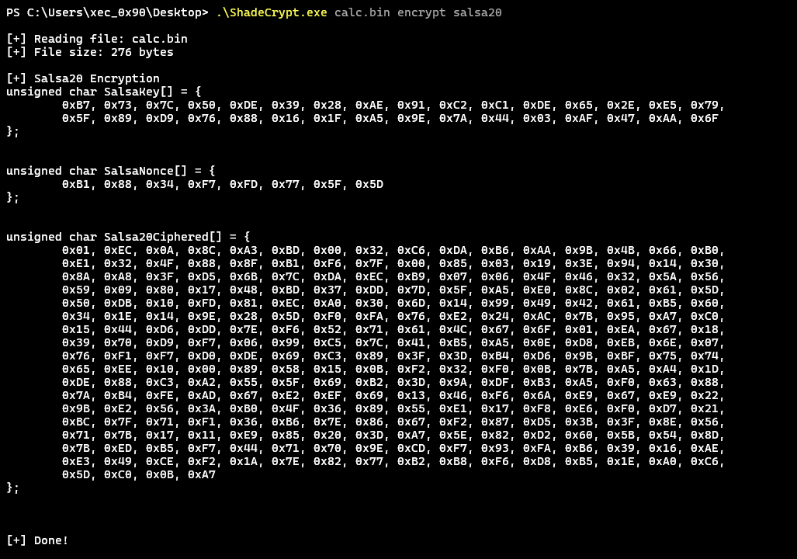
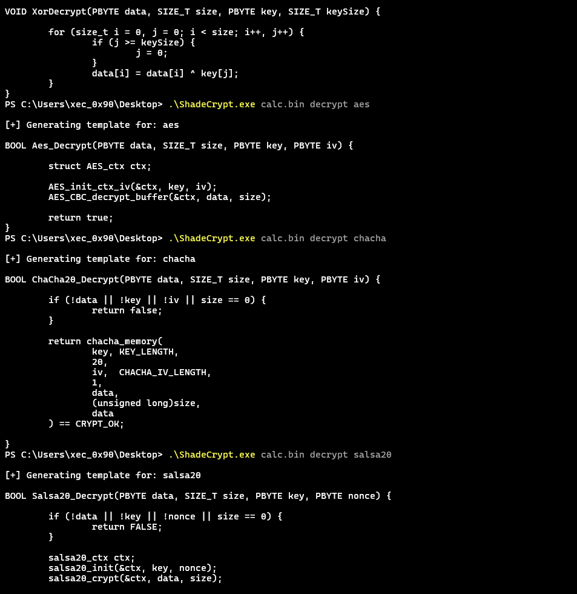
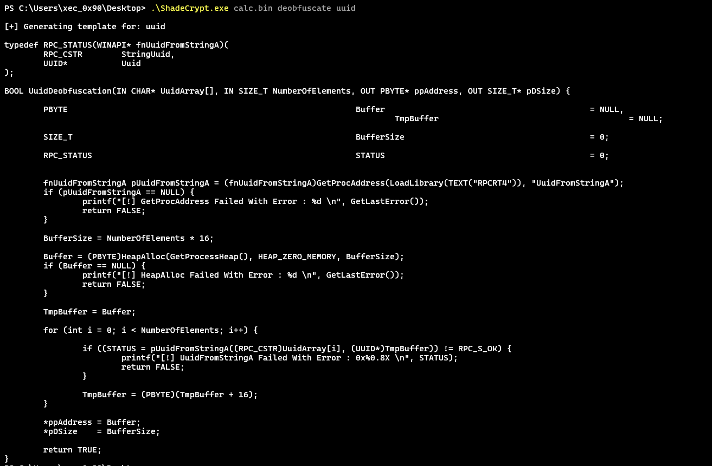
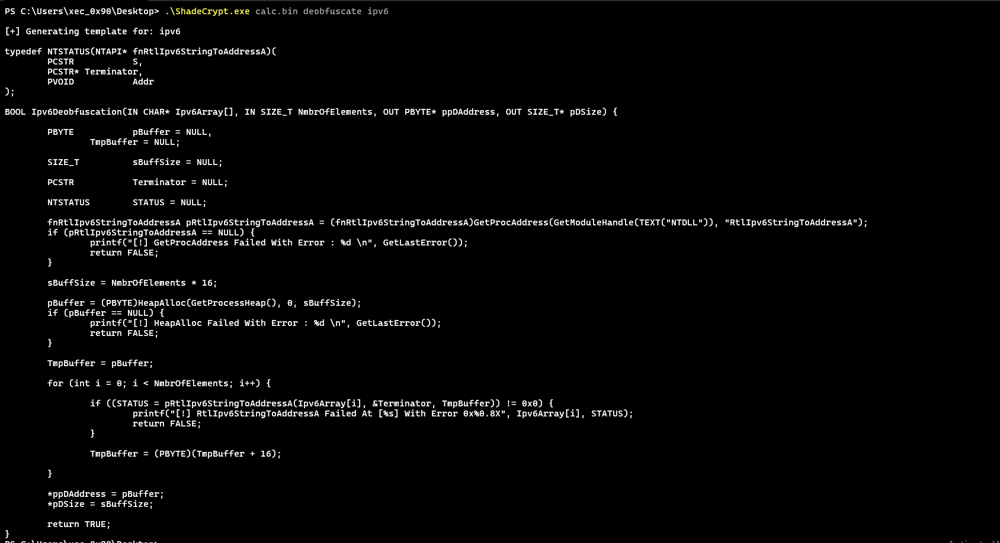
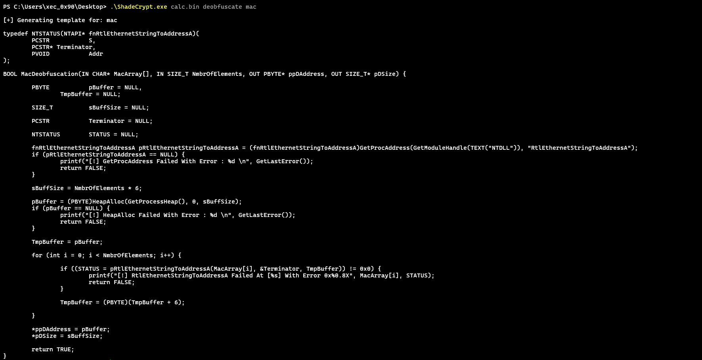

# 🌑 ShadeCrypt

> **Advanced payload encryption & obfuscation tool combining multiple evasion techniques**

ShadeCrypt is a Windows-native payload transformation toolkit built for red team engagements, adversary simulation exercises, and advanced security research.
 It combines modern encryption primitives with structured obfuscation techniques to support controlled offensive security workflows.

---

## 🎯 **Features**

### **Encryption Algorithms**
- **AES-256-CBC** - Industry-standard block cipher with PKCS7 padding
- **ChaCha20** - Modern stream cipher (Google/Cloudflare approved)
- **Salsa20** - High-performance stream cipher by D.J. Bernstein
- **XOR** - Simple yet effective byte-wise encryption

### **Obfuscation Techniques**
- **UUID Strings** - Convert bytes to Windows GUID format
- **IPv6 Addresses** - Disguise payload as network addresses
- **MAC Addresses** - Hardware address-based obfuscation

### **Key Capabilities**
✅ **Auto Template Generation** - Ready-to-use decoder functions  
✅ **Cryptographically Secure RNG** - BCrypt-based key generation  
✅ **Zero Dependencies** - Standalone executable  
✅ **Professional CLI** - Clean, intuitive interface  
✅ **Multiple Output Formats** - C arrays, hex dumps  

---

## 📸 Screenshots

### CLI Interface


### Encryption Outputs





### Decrypt Templates


### Obfuscation Outputs


### Deobfuscate Templates





## 🔧 **Installation**

### **Prerequisites**
- Visual Studio 2019+ or MinGW-w64
- Windows SDK 10.0+
- BCrypt library (included in Windows)

### **Build from Source**

**Option 1: Visual Studio**
```cmd
1. Open ShadeCrypt.sln
2. Select Release | x64
3. Build > Build Solution
4. Output: x64/Release/ShadeCrypt.exe
```

**Option 2: Command Line (MSBuild)**
```cmd
msbuild ShadeCrypt.sln /p:Configuration=Release /p:Platform=x64
```

**Option 3: MinGW**
```bash
gcc -o ShadeCrypt.exe src/*.c lib/*.c -Iinclude -O2 -lbcrypt -lrpcrt4 -lntdll
```

---

## 📖 **Usage**

### **Basic Syntax**
```
ShadeCrypt.exe <input_file> <action> <method>
```

### **Actions**
- `encrypt` - Encrypt or obfuscate the input file
- `decrypt` - Generate decryption template code

### **Methods**

**Encryption:**
- `xor` - XOR encryption
- `aes` - AES-256-CBC encryption
- `chacha` - ChaCha20 encryption
- `salsa20` - Salsa20 encryption

**Obfuscation:**
- `uuid` - UUID string obfuscation
- `ipv6` - IPv6 address obfuscation
- `mac` - MAC address obfuscation

---

## 💡 **Examples**

### **1. XOR Encryption**
```bash
ShadeCrypt.exe payload.bin encrypt xor
```
**Output:**
```c
unsigned char XorKey[] = {
    0x9A, 0x3F, 0x7E, 0x2B, ...
};
unsigned char XorCiphered[] = {
    0x4F, 0xA3, 0xE1, 0x88, ...
};
```

### **2. ChaCha20 Encryption**
```bash
ShadeCrypt.exe beacon.bin encrypt chacha
```
**Output:**
```c
unsigned char ChaChaKey[32] = { ... };
unsigned char ChaChaIv[12] = { ... };
unsigned char ChaCha20Ciphered[] = { ... };
```

### **3. UUID Obfuscation**
```bash
ShadeCrypt.exe shellcode.bin encrypt uuid
```
**Output:**
```c
char* UuidArray[] = {
    "E48348FC-E8F0-00C0-0000-415141505251",
    "D2314856-4865-528B-6048-8B5218488B52",
    ...
};
```

### **4. Generate Decoder Template**
```bash
ShadeCrypt.exe payload.bin decrypt uuid
```
**Output:** Complete C code with `UuidDeobfuscate()` function ready to compile

---

## 🎨 **Advanced Usage**

### **Multi-Layer Encryption**
Combine multiple techniques to simulate real-world red team tradecraft:

```bash
# Step 1: XOR encrypt
ShadeCrypt.exe payload.bin encrypt xor > stage1.txt

# Step 2: Take encrypted output and UUID obfuscate
ShadeCrypt.exe encrypted.bin encrypt uuid > stage2.txt

# Step 3: Encrypt again with ChaCha20
ShadeCrypt.exe obfuscated.bin encrypt chacha > final.txt
```

### Red Team Integration Workflow
```
1. Encrypt payload        → ShadeCrypt.exe calc.bin encrypt chacha
2. Generate decoder stub  → ShadeCrypt.exe calc.bin decrypt chacha
3. Integrate into loader  → Embed template into your project
4. Compile and validate   → Test in controlled lab environment

```

---

## 🛡️ **Security Considerations**

### **Encryption Strength**

| Method | Key Size | Cipher Type | Operational Notes |
|--------|----------|-------------|------------------|
| XOR | Variable | Stream | Lightweight obfuscation |
| AES-256 | 256-bit | Block | Industry standard symmetric cipher |
| ChaCha20 | 256-bit | Stream | High-performance modern cipher |
| Salsa20 | 256-bit | Stream | DJB-designed stream cipher |

### Operational Considerations
- **UUID Encoding**: Transforms raw byte sequences into structured GUID representations commonly observed in Windows environments.
- **IPv6 Encoding**: Converts payload data into network-like structures for alternative representation.
- **MAC Encoding**: Useful for compact structured formatting of smaller payloads.

### Operational Notes
- Use unique keys per engagement.
- Avoid reusing transformation patterns across assessments.
- Always validate behavior in controlled and authorized lab environments.
- Encryption does not replace proper operational security practices.

---

## 📚 **Technical Details**

### **Cryptographic Implementation**
- **AES-256**: Tiny-AES-C library (optimized for size)
- **ChaCha20**: LibTomCrypt implementation (20 rounds)
- **Salsa20**: Custom implementation per DJB specification
- **RNG**: Windows BCryptGenRandom (NIST SP 800-90A compliant)

### **Obfuscation Methods**
- **UUID**: RFC 4122 compliant GUID generation
- **IPv6**: RtlIpv6StringToAddressA conversion
- **MAC**: IEEE 802 MAC-48 format

### **Memory Safety**
- Heap allocation with proper cleanup
- Buffer overflow protection
- Secure zero-out of sensitive data
- No hardcoded credentials or keys

---

## 🏗️ **Project Structure**

```
ShadeCrypt/
├── src/
│   ├── ShadeCrypt.c           # Main entry point
│   ├── AesEncryption.c        # AES-256 implementation
│   ├── ChaChaEncryption.c     # ChaCha20 wrapper
│   ├── Salsa20Encryption.c    # Salsa20 wrapper
│   ├── XorEncryption.c        # XOR encryption
│   ├── UuidObfuscation.c      # UUID string generation
│   ├── Ipv6Obfuscation.c      # IPv6 conversion
│   ├── MacObfuscation.c       # MAC address formatting
│   ├── Utils.c                # File I/O, RNG, helpers
│   └── Templates.c            # Decoder template strings
├── include/
│   ├── Common.h               # Shared headers & prototypes
│   ├── Templates.h            # Template declarations
│   ├── aes.h                  # AES header
│   ├── ChaCha.h               # ChaCha header
│   └── Salsa20.h              # Salsa20 header
├── lib/
│   ├── aes.c                  # Tiny-AES-C library
│   ├── ChaCha.c               # LibTomCrypt ChaCha20
│   └── Salsa20.c              # Custom Salsa20 core
└── docs/
    ├── USAGE.md               # Detailed usage guide
    ├── EXAMPLES.md            # Real-world examples
    └── screenshots/           # Tool demonstrations
```

---

## ⚖️ **Legal Disclaimer**

**FOR EDUCATIONAL AND AUTHORIZED TESTING ONLY**

This tool is provided for:
- ✅ Security research and education
- ✅ Authorized penetration testing
- ✅ Red team exercises with written permission
- ✅ Malware analysis and reverse engineering

**PROHIBITED USES:**
- ❌ Unauthorized access to computer systems
- ❌ Distribution of malicious software
- ❌ Any illegal activities

**The author assumes NO responsibility for misuse of this software. Users are solely responsible for compliance with applicable laws and regulations.**

By using ShadeCrypt, you agree to use it only for lawful purposes and acknowledge that unauthorized computer access is a crime in most jurisdictions.

---

## 📜 **License**

This project is licensed under a **Custom Educational License** - see the [LICENSE](LICENSE) file for details.

**Summary:**
- ✅ Free for educational use
- ✅ Free for authorized security testing
- ❌ Commercial use requires permission
- ❌ Prohibited for malicious purposes

---

## 🙏 **Acknowledgments**
- **Maldev Academy** – Educational material on Windows internals and low-level payload concepts that inspired parts of this implementation.
- **Tiny-AES-C** - Compact AES implementation
- **LibTomCrypt** - ChaCha20 reference code
- **D.J. Bernstein** - Salsa20 cipher design
- **Red Team Community** - Inspiration and testing

---

## 📞 **Contact**

- **Author**: xec412
- **GitHub**: [@xec412](https://github.com/xec_412)
- **Project**: [ShadeCrypt](https://github.com/xec_412/ShadeCrypt)

---

## 🔖 **Version History**

### **v1.0.0** (Initial Release)
- ✅ AES-256, ChaCha20, Salsa20, XOR encryption
- ✅ UUID, IPv6, MAC obfuscation
- ✅ Automatic template generation
- ✅ Cryptographically secure RNG
- ✅ Professional CLI interface

---

<p align="center">
  <b>⚡ Made with 🖤 for the Red Team Community ⚡</b>
</p>

<p align="center">
  <i>If this project helped you, consider giving it a ⭐ star!</i>
</p>
